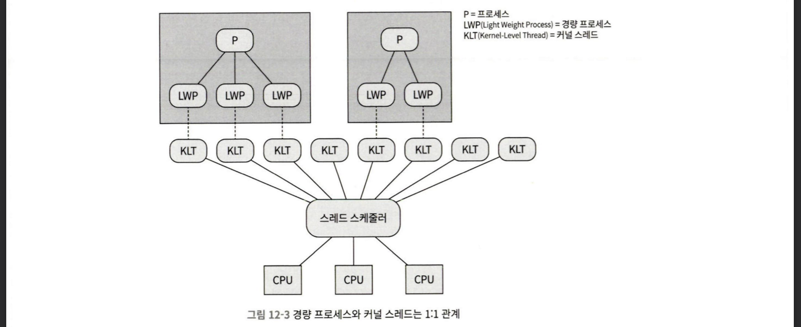
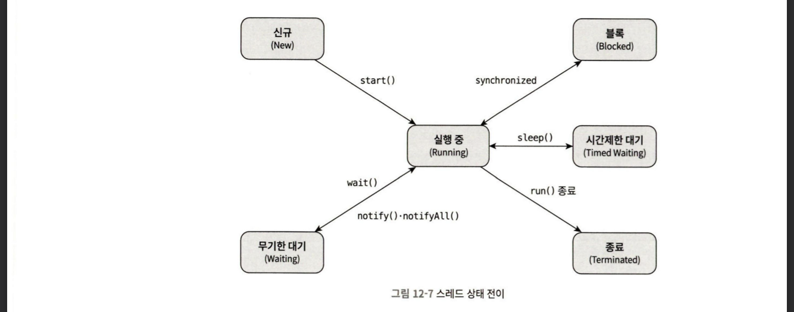
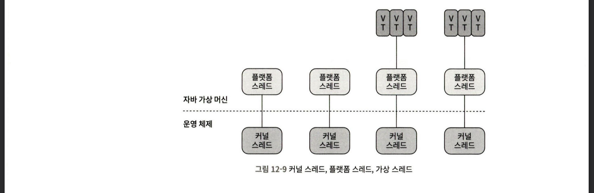

# 12장 자바 메모리 모델과 스레드

12장을 먼저 읽게 된 이유는 현재 가장 관심있는 부분이 메모리 모델과 스레드 관련 작업이기 때문입니다. 해당 내용을 읽고, 새로 알게 된 내용에 대해서 작성해보도록 하겠습니다.

## 12.1 들어가며
멀티태스킹은 컴퓨터 연산에서 없어서는 안될 작업이다. 유튜브 영상을 보면서 댓글을 읽어야 하고, 댓글을 읽으면서 반응도 추가해야하고, 다른 관련 영상들에는 뭐가 있을까 구경을 해야하기 때문이다.

이렇게 컴퓨터가 여러 작업을 동시에 수행할 수 있는 이유는 **연산 능력**이 매우 뛰어나다는 이유 뿐 아니라, 저장 및 통신 성능(디스크 I/O, 네트워크 통신 / DB 접근 등)의 격차가 매우 크기 때문이다.

이러한 흐름 속에서 서비스에 대한 초당 트랜잭션 수(= TPS)가 중요한 지표이고, 이 지표는 프로그램의 동시성 기능과 매우 밀접하다. 프로그램이 더 많은 스레드를 동시에 운용할 수 있게 되면서 작업 효율이 높아짐과 동시에 같은 데이터를 두고, 스레드끼리 경합을 벌이는 교착 상태에 빠지는 상황으로 동시성이 크게 감소할 수 있다는 양면성이 존재한다.

이러한 동시성 프로그래밍 기법은 매우 어려운 주제이기 때문에 JVM이 이를 어떻게 처리할 지에 알아가는 것이 중요한 포인트가 될 것 같다.

## 12.2 하드웨어에서의 효율과 일관성

동시성 문제가 어려운 이유는 단순히 프로세서의 컴퓨팅(연산)만으로 이루어질 수 없다는 데 있다. 프로세서는 데이터를 읽고, 작업 결과를 저장해야하므로 적어도 메모리는 반드시 필요하다. 그러나, 메모리는 너무 느리다. 프로세서와 메모리 사이에 "캐시"라는 계층을 둠으로써 프로세서와 메모리의 속도 격차를 원만하게 해결할 수 있다.


그렇다면, 여러 프로세서가 병렬적으로 작업을 할 때, 각 프로세서마다 캐시 데이터가 다를 수 있다는 생각을 할 수 있다. 즉, "캐시 일관성"문제가 발생한다.

일관성 문제를 해결하기 위해서는 프로세서가 캐시를 이용할 때, 정해진 프로토콜을 따라야 한다. 여기서 등장하는 개념이 바로 "메모리 모델"이다. **메모리 모델**은 특정 프로토콜을 이용하여 특정 메모리나 캐시를 읽고 쓰는 절차를 말한다. JVM(자바 가상 머신)은 자체 메모리 모델을 가진다.

프로세서는 "비순차 실행 최적화(out-of-order execution optimization)"로도 프로세서의 컴퓨팅 능력을 더 이끌어 낼 수 있다. 실제로 알고리즘 문제를 풀다보면 JVM 내부에서 최적화를 통해 명령어 순서를 입력 코드에 기술된 명령어 순서와 다르게 해석할 수 있다. 물론, 결과는 같도록 재구성한다. 프로세서 뿐 아니라, JVM 내에서도 JIT(Just In Time) 컴파일러가 명령어 재정렬이라는 최적화를 수행한다.

## 12.3 자바 메모리 모델

앞서 본 것처럼 하드웨어마다, 운영 체제마다 메모리 모델이 다르다. 그렇다면 "Write Once, Run Anywhere"를 외치는 자바 입장에서는 곤란하다. 같은 코드가 플랫폼마다 다르게 동작하면 안 되기 때문이다. 그래서 **《자바 가상 머신 명세》는 자체 자바 메모리 모델(JMM)을 따로 정의**해서, 어떤 플랫폼에서 돌리든 자바 프로그램이 메모리를 일관된 방식으로 사용할 수 있도록 보호한다.

반면 C/C++ 같은 언어는 하드웨어와 OS의 메모리 모델을 직접 사용한다. 그래서 한 플랫폼에서는 멀쩡히 돌던 프로그램이 다른 플랫폼에서는 동작하지 않아 플랫폼별로 맞춤 제작해야 하는 경우가 많다. 자바 메모리 모델이 이 골치 아픈 부분을 대신 막아주는 셈이다. 참고로 이 모델은 오랜 검증과 개정을 거쳐 **JDK 5에 와서야 마침내 완성**되었다.

### 12.3.1 메인 메모리와 작업 메모리

자바 메모리 모델의 핵심 목적은 **변수에 접근하는 규칙을 정하는 것**이다. 그런데 여기서 말하는 "변수"는 우리가 평소에 생각하는 변수와 살짝 다르다.

- 포함되는 것: **인스턴스 필드, 정적 필드, 배열 객체의 원소** (여러 스레드가 공유할 수 있는 것들)
- 제외되는 것: **지역 변수, 메서드 매개 변수** (스레드별 고유 공간이라 경합 자체가 없음)

이 모델에서 메모리는 두 종류로 나뉜다.

- **메인 메모리(Main Memory)**: 모든 변수가 저장되는 공간
- **작업 메모리(Working Memory)**: 스레드마다 하나씩 갖는, 프로세서의 캐시와 비슷한 역할을 하는 공간

여기서 중요한 규칙이 몇 가지 있다.

1. 스레드가 변수를 읽고 쓰는 모든 연산은 **작업 메모리에서만** 수행된다. 메인 메모리의 데이터를 직접 읽고 쓸 수 없다.
2. 스레드끼리는 서로의 작업 메모리에 **직접 접근할 수 없다**. 반드시 메인 메모리를 거쳐 값을 전송해야 한다.

즉, 작업 메모리에는 해당 스레드가 사용하는 변수의 **메인 메모리 복사본**이 담겨 있는 것이다. 이 구조 때문에 "한 스레드가 값을 바꿨는데 다른 스레드는 옛날 값을 보는" 가시성 문제가 자연스럽게 생긴다.

> 비유하자면 메인 메모리는 자바 힙 중 객체 인스턴스 데이터, 작업 메모리는 스택 영역의 일부에 대응한다. 더 하드웨어 관점으로 내려가면 메인 메모리 = 하드웨어 메모리, 작업 메모리 = 레지스터와 캐시에 대응한다. 가상 머신은 성능을 위해 작업 메모리를 되도록 레지스터나 캐시에 미리 올려둔다.

### 12.3.2 메모리 간 상호 작용

메인 메모리와 작업 메모리 사이의 동기화를 자바 메모리 모델은 **8가지 원자적 연산**으로 정의했다.

| 연산 | 대상 | 설명 |
| --- | --- | --- |
| `lock`(잠금) | 메인 메모리 | 변수를 특정 스레드 전용으로 만든다 |
| `unlock`(잠금 해제) | 메인 메모리 | 잠긴 변수를 해제한다 |
| `read`(읽기) | 메인 메모리 | 변숫값을 작업 메모리로 전송한다 |
| `load`(적재) | 작업 메모리 | 읽어온 값을 작업 메모리 변수에 넣는다 |
| `use`(사용) | 작업 메모리 | 변숫값을 실행 엔진으로 전달한다 |
| `assign`(할당) | 작업 메모리 | 실행 엔진에서 받은 값을 변수에 할당한다 |
| `store`(저장) | 작업 메모리 | 변숫값을 메인 메모리로 전송한다 |
| `write`(쓰기) | 메인 메모리 | 전송된 값을 메인 메모리 변수에 기록한다 |

여기서 새로 알게 된 포인트는 **`read`와 `load`, `store`와 `write`는 반드시 순서대로 수행되어야 한다**는 것이다. 단, "순서대로"일 뿐 "바로 이어서"일 필요는 없다. 즉 `read a → read b → load b → load a` 처럼 중간에 다른 연산이 끼어들 수 있다. 이 미묘한 틈이 바로 동시성 버그가 숨는 자리다.

### 12.3.3 volatile 변수용 특별 규칙

`volatile`은 자바 가상 머신이 제공하는 **가장 가벼운 동기화 메커니즘**이다. 그런데 제대로 이해하기가 까다로워서 많은 개발자가 그냥 `synchronized`를 쓰는 편이다. `volatile`로 선언하면 변수는 두 가지 특성을 갖는다.

**① 가시성(visibility) 보장**
모든 스레드에서 이 변수를 "투명하게" 볼 수 있다. 한 스레드가 값을 수정하면 다른 스레드들도 새로운 값을 즉시 알게 된다. 일반 변수는 A가 수정 → 메인 메모리에 기록(write back) → B가 다시 읽기 라는 과정을 거쳐야 하지만, `volatile`은 이 과정이 즉시 강제된다.

**② 명령어 재정렬 최적화 금지**
앞서 본 비순차 실행/명령어 재정렬을 막아준다.

다만 여기서 가장 중요한 함정이 있다. **`volatile`은 가시성만 보장할 뿐, 연산의 원자성은 보장하지 않는다.** 그래서 멀티스레드 환경에서 완벽하게 안전하지는 않다.

```java
public class VolatileTest {
    public static volatile int race = 0;

    public static void increase() {
        race++;   // 한 줄처럼 보이지만 원자적이지 않다
    }
    // 20개 스레드가 각각 10000번 increase() 호출
    // 기대값: 200,000  →  실제: 매번 200,000보다 작음
}
```

왜 그럴까? `increase()`를 `javap`로 디컴파일하면 `race++`가 **명령어 4개**로 이루어진 걸 볼 수 있다.

```
getstatic   #7   // race 값을 피연산자 스택으로 가져옴 (이때 volatile로 최신값 확인)
iconst_1
iadd             // 이 사이에 다른 스레드가 race를 바꾸면…
putstatic   #7   // 변경 전 값에 기반한 결과를 메인 메모리에 써버림
return
```

`getstatic`으로 최신값을 가져온 직후, `iadd`를 수행하는 사이에 다른 스레드가 `race`를 바꾸면, 피연산자 스택의 값은 이미 낡은 값이 된다. **즉, "읽기 → 연산 → 쓰기"가 하나로 묶이지 않기 때문에 `volatile`만으로는 부족하다.** 이 경우엔 `synchronized`나 `java.util.concurrent`의 원자적 클래스(`AtomicInteger` 등), 락을 함께 써야 한다.

> **`volatile`이 정말 적합한 시나리오**
> - 연산 결과가 변수의 현재 값과 무관하거나, 값을 수정하는 스레드가 하나뿐일 때
> - 다른 상태 변수와 얽힌 불변성 제약이 없을 때
> 대표 예가 `shutdownRequested = true` 같은 **상태 플래그**다. 한 스레드가 `true`로 바꾸면 나머지 스레드가 즉시 종료되도록 보장할 수 있다.

**② 명령어 재정렬 금지가 빛나는 예 — DCL 싱글턴**

```java
public class Singleton {
    private volatile static Singleton instance;   // volatile이 핵심

    public static Singleton getInstance() {
        if (instance == null) {
            synchronized (Singleton.class) {
                if (instance == null) {
                    instance = new Singleton();
                }
            }
        }
        return instance;
    }
}
```

`instance = new Singleton()`은 실제로는 "메모리 할당 → 생성자 호출 → 참조 대입"의 여러 단계인데, 재정렬이 일어나면 "참조 대입"이 "생성자 호출"보다 먼저 실행될 수 있다. 그러면 다른 스레드가 **아직 초기화되지 않은 객체**를 보게 된다. `volatile`을 붙이면 어셈블리에 `lock addl $0x0,(%esp)` 같은 **메모리 장벽(memory barrier)** 명령이 추가되어 장벽 뒤의 명령을 앞으로 재정렬하지 못하게 막는다. (이 때문에 JDK 5 이전에는 DCL이 제대로 동작하지 않았다.)

**성능 정리**
- `lock` 방식보다 성능이 좋다.
- 읽기 성능은 일반 변수와 거의 같다.
- 쓰기는 메모리 장벽 명령어가 끼어들어 더 느릴 수 있다. (그래도 대부분 상황에서 락보다는 전체 부하가 적다.)

### 12.3.4 long과 double 변수용 특별 규칙

자바 메모리 모델은 8가지 기본 연산이 모두 원자적이어야 한다고 규정하지만, **64비트 데이터 타입인 `long`과 `double`에는 좀 더 느슨한 규칙**이 적용된다. `volatile`로 지정되지 않은 64비트 데이터의 읽기/쓰기를 **32비트 연산 2개로 나눠 처리**할 수 있도록 허용한 것이다. 이를 "long과 double 변수의 비원자적 처리"라고 한다.

이론상으론 "반만 수정된" 값을 읽을 위험이 있지만, **실무에서는 거의 일어나지 않는다.** 현재 주류 상용 64비트 가상 머신에서는 비원자적 접근이 관측되지 않았고, JDK 9부터 핫스팟은 `-XX:+AlwaysAtomicAccesses` 매개 변수로 모든 데이터 타입을 원자적으로 접근하게 할 수 있다. 결론적으로 **스레드 경합이 뻔한 상황이 아니라면 단지 `long`/`double`이라는 이유로 굳이 `volatile`을 붙일 필요는 없다.**

### 12.3.5 원자성, 가시성, 실행 순서

자바 메모리 모델이 동시성 처리에서 다루는 세 가지 핵심 특성을 정리해보면 다음과 같다. (이 셋을 분리해서 보는 시각이 개인적으로 가장 도움이 됐다.)

**원자성(Atomicity)**
- 기본 데이터 타입의 `read/load/use/assign/store/write`는 대체로 원자적이다.
- 더 넓은 범위가 필요하면 `lock`/`unlock`을 쓰는데, 자바는 이를 직접 노출하지 않고 한 단계 추상화된 `monitorenter`/`monitorexit` 바이트코드로 제공한다. 이게 자바 코드의 **`synchronized` 블록**에 해당한다.

**가시성(Visibility)**
- 한 스레드의 수정 결과를 다른 스레드가 즉시 알 수 있는 성질.
- 가시성을 보장하는 키워드가 **세 개** 있다: `volatile`, `synchronized`, `final`.
  - `synchronized`: 잠금 해제 전에 변숫값을 메인 메모리에 동기화하므로 가시성 확보.
  - `final`: 생성자에서 초기화가 완료된(this가 탈출하지 않은) `final` 필드는 다른 스레드가 동기화 없이도 올바르게 본다.

**실행 순서(Ordering)**
- 현재 스레드 안에서 보면 모든 연산이 순차적이다(within-thread as-if-serial). 하지만 **다른 스레드에서 보면 순서가 달라 보일 수 있다.** 이게 "명령어 재정렬"과 "메인↔작업 메모리 동기화 지연" 현상이다.
- 순서를 보장하는 키워드는 `volatile`(재정렬 금지)과 `synchronized`(한 번에 한 스레드만 진입)다.

### 12.3.6 선 발생 원칙 (happens-before)

만약 모든 실행 순서를 `volatile`과 `synchronized`로만 처리한다면 코드가 매우 장황해진다. 다행히 자바에는 **선 발생 원칙(happens-before)** 이 있어서, 몇 가지 규칙만으로 두 작업의 충돌 가능성을 판단할 수 있다.

"A가 B보다 선 발생한다"는 것은 **B가 수행되기 전에 A의 영향(변수 변경, 메서드 호출 결과 등)을 B에서 관찰할 수 있다**는 뜻이다. 동기화 장치 없이도 자연스럽게 보장되는 대표 규칙은 다음과 같다.

- **프로그램 순서 규칙**: 한 스레드 안에서는 제어 흐름 순서에 따라 앞 연산이 뒤 연산보다 선 발생한다.
- **모니터 락 규칙**: 잠금 해제 연산은 같은 락에 대한 잠금 연산보다 선 발생한다.
- **휘발성 변수 규칙**: `volatile` 변수의 쓰기는 같은 변수의 읽기보다 선 발생한다.
- **스레드 시작 규칙**: `Thread.start()`는 해당 스레드의 어떤 작업보다도 선 발생한다.
- **스레드 종료 규칙**: 스레드의 모든 작업은 해당 스레드의 종료 감지(`join()`, `isAlive()`)보다 선 발생한다.
- **스레드 인터럽트 규칙**: `interrupt()` 호출은 인터럽트 이벤트 감지보다 선 발생한다.
- **종료자 규칙**: 객체 초기화 완료는 `finalize()` 시작보다 선 발생한다.
- **전이성**: A → B, B → C 이면 A → C.

여기서 **가장 핵심적인 교훈**은 이것이다.

> **시간 순서(time order)와 선 발생(happens-before)은 인과 관계가 없다.**
> 시간상 먼저 실행됐다고 선 발생하는 것도 아니고, 선 발생한다고 시간상 먼저인 것도 아니다. 따라서 **동시성 안전 문제는 시간 순서가 아니라 선 발생 원칙으로 판단해야 한다.**

예를 들어 평범한 게터/세터(`getValue()`/`setValue()`)는 어떤 선 발생 규칙도 적용되지 않으므로, A가 시간상 먼저 `setValue(1)`을 호출하더라도 B가 `getValue()`로 1을 얻는다는 보장이 없다. 이때는 세터를 `synchronized`로 만들거나 `value`를 `volatile`로 선언해서 선 발생 관계를 만들어줘야 한다.

## 12.4 자바와 스레드

동시성이라고 해서 반드시 멀티스레딩을 뜻하진 않지만(PHP는 멀티프로세스 동시성이 일반적이다), **자바에서 동시성은 기본적으로 스레드와 분리해 이야기할 수 없다.**

### 12.4.1 스레드 구현

스레드는 **프로세스보다 가벼운 스케줄링 단위**다. 스레드 각각은 프로세스 자원(메모리 주소, 파일 I/O 등)을 공유하면서 독립적으로 스케줄링된다. 구현 방법은 크게 세 가지다.

**① 커널 스레드 구현 (1:1)**

운영 체제 커널이 직접 지원하는 스레드. 커널 스레드의 고수준 인터페이스인 **경량 프로세스(LWP, Light Weight Process)** 를 통해 프로그램이 사용한다. 강점은 안정성이지만, 생성·소멸·동기화가 모두 **시스템 호출**로 이루어져 사용자 모드 ↔ 커널 모드 전환 비용이 크다.

**② 사용자 스레드 구현 (1:N)**

온전히 사용자 공간에서 구현되는 스레드. 커널의 도움 없이 처리되므로 매우 빠르고 가볍지만, 블로킹 처리·멀티프로세서 매핑 같은 문제를 프로그램이 직접 해결해야 해서 구현이 복잡하다. 그래서 자바와 루비는 한때 썼다가 결국 포기했다. (단, 고 언어·얼랭 등 최근 언어들이 다시 부흥시키는 중.)

**③ 하이브리드 구현 (M:N)**

사용자 스레드와 경량 프로세스를 함께 쓰는 방식. 커널이 제공하는 스케줄링·매핑을 활용하면서도 동시성 규모를 키울 수 있다.

**자바 스레드의 역사가 흥미로웠다.**
- JDK 1.2 이전 클래식 VM: 자바 스레드를 **그린 스레드(green thread)**, 즉 사용자 스레드로 구현.
- JDK 1.3부터: 운영 체제의 기본 스레드 모델(주로 1:1)을 기반으로 선회. 핫스팟에서 자바 스레드는 OS 커널 스레드에 직접 매핑된다.
- **JDK 21**: 가상 스레드(virtual thread) 정식 도입 → 12.5에서 본격적으로 다룬다.

### 12.4.2 자바 스레드 스케줄링

스케줄링이란 시스템이 프로세서 사용 권한을 스레드에 할당하는 일이다. 방법은 두 가지다.

- **협력적 스케줄링**: 스레드가 스스로 실행 시간을 제어한다. 구현이 쉽고 동기화 문제가 거의 없지만, 한 스레드가 양보를 안 하면 시스템 전체가 멈춘다(옛날 윈도우 3.x). 루아의 코루틴이 대표적.
- **선점형 스케줄링**: 시스템이 실행 시간을 할당한다. 한 스레드가 폭주해도 시스템이 강제로 회수할 수 있다. **자바는 이 방식을 쓴다.**

자바는 `Thread.MIN_PRIORITY`부터 `Thread.MAX_PRIORITY`까지 **10단계 우선순위**를 제공한다. 다만 이건 운영 체제에 대한 "권고"일 뿐 신뢰할 만한 조율 수단이 아니다. 윈도우는 우선순위 단계가 7개뿐이라 자바의 1·2, 3·4, 6·7, 8·9는 실제로 차이가 없고, 우선순위 부스팅 같은 OS 기능 때문에 결과가 또 달라진다. **즉, 우선순위에 동작을 의존하면 안 된다.**

### 12.4.3 상태 전이

자바 스레드는 어느 시점이든 다음 **여섯 가지 상태** 중 하나에 놓인다.

| 상태 | 설명 |
| --- | --- |
| **신규(New)** | 생성됐지만 아직 시작 전 |
| **실행 중(Runnable)** | OS의 running과 ready를 합친 상태 (실행 중이거나 실행 시간 할당 대기) |
| **무기한 대기(Waiting)** | 다른 스레드가 명시적으로 깨워줘야 함 (`Object.wait()`, `Thread.join()`, `LockSupport.park()`) |
| **시간 제한 대기(Timed Waiting)** | 일정 시간 지나면 자동으로 깨어남 (`Thread.sleep()`, 타임아웃 있는 `wait()`/`join()`) |
| **블록(Blocked)** | 배타적 락 획득을 기다림 (동기화 영역 진입 대기) — '대기'와 다른 점은 **락 획득**을 기다린다는 것 |
| **종료(Terminated)** | 실행을 마침 |



> **대기 vs 블록**을 헷갈렸었는데, **블록은 "다른 스레드가 락을 풀어줄 때까지", 대기는 "다른 스레드가 깨워줄 때까지"** 기다린다는 점이 다르다.

## 12.5 자바와 가상 스레드

자바는 OS별 스레드 모델 차이를 숨기는 통합 인터페이스를 제공했고, 이는 탄생 초기 큰 장점이었다. 서블릿으로 HTTP 요청 하나를 스레드 하나에 매핑하는 "1:1 서비스"가 대표적이다. 하지만 이 1:1 모델이 **요즘 시대에는 오히려 족쇄가 되기도 한다.** (이 절이 백엔드 입장에서 가장 와닿았다.)

### 12.5.1 커널 스레드의 한계

오늘날 웹 서비스는 마이크로서비스로 세분화되면서, 여러 외부 서비스에 요청을 분산해 응답을 취합하는 일이 흔하다. 각 서비스가 매우 빠르게 끝나야 전체 응답이 합리적인 시간 안에 완성된다.

문제는 자바 스레드가 OS 커널 스레드에 1:1로 매핑되다 보니 **전환·스케줄링 비용이 크고, 동시에 띄울 수 있는 스레드 수도 제한된다**는 점이다. 과거 모놀리식에서는 요청당 처리 시간이 길어서 스레드 전환 비용이 묻혔지만, 이제는 요청당 실행 시간이 매우 짧아져서 **사용자 스레드 전환 부하가 계산 자체의 부하에 근접**할 만큼 비효율이 커졌다.

> 기존 자바 웹 서버의 스레드 풀 용량은 보통 수십~200개 수준이다. (예: 톰캣 기본 최대 200개) 여기에 수백만 요청을 쏟아부으면 전환 손실이 상당하다. 그래서 사람들이 옛날 **그린 스레드**가 주던 이점을 그리워하게 됐다.

### 12.5.2 코루틴의 귀환

해법의 실마리는 **코루틴(coroutine)** 이다. 핵심은 문맥 전환(레지스터·캐시 데이터 저장·복원) 비용을 줄이는 것.

- **스택풀 코루틴(stackful)**: 콜 스택을 완벽히 보관·복원. 과거 사용자 스레드가 여기 해당하며, 협력적 스케줄링이라 "코루틴"으로 불렸다.
- **스택리스 코루틴(stackless)**: 상태를 클로저에 저장하는 유한 상태 머신. 복원 비용은 더 싸지만 기능은 제한적. `await`, `async`, `yield` 같은 키워드가 여기 속한다.

코루틴의 가장 큰 장점은 **가볍다**는 것이다. 핫스팟 스레드 스택은 보통 1MB + 커널 데이터 구조용 16KB가 추가로 드는데, 코루틴 스택은 수백 바이트~수 KB 수준이다. 그래서 스레드 풀이 200개일 때, 코루틴은 **수십만 개가 공존**할 수 있다.

### 12.5.3 가상 스레드: 자바의 해법

스택풀 코루틴을 자바가 구현한 것이 **파이버(Fiber)** → 지금의 **가상 스레드**다.

- 2017년 OpenJDK가 **룸 프로젝트(Project Loom)** 출범 → **JDK 21에 정식 반영**.
- 초기 이름은 파이버였으나 혼동을 피해 "가상 스레드"로 변경.
- 기존 스레드 모델과 **공존**한다(대체가 아님). 가상 스레드는 운영 체제가 아니라 **자바 가상 머신이 직접 스케줄링**한다.



가상 스레드는 **플랫폼 스레드(= 기존 자바 스레드)와 N:M 관계**다. 가상 스레드 하나가 블록되면 플랫폼 스레드는 연결된 다른 가상 스레드 작업을 이어서 진행한다. 즉 **커널 스레드는 문맥 전환 없이 쉬지 않고 애플리케이션 코드를 실행**하는 것이다. 게다가 기존 스레드 API를 최소한만 수정하도록 설계해서, **기존 코드를 큰 수정 없이 가상 스레드로 옮길 수 있다.**

**벤치마크가 인상적이었다.** 마리아DB(MariaDB) JDBC 커넥터에 가상 스레드를 적용했더니, 네 가지 시나리오 모두에서 플랫폼 스레드 대비 **4.3~5.3배 빠른 성능**을 보였다(논블로킹 기반 R2DBC보다도 빨랐다).

> 단, 핵심은 **가상 스레드의 이점은 I/O 작업이 많아서 스레드 전환이 잦은 상황에서 드러난다**는 점이다. CPU 바운드 연산만 하는 작업이라면 별 차이가 없을 수 있다. DB 연결처럼 I/O 비중이 큰 백엔드 작업에 특히 효과적이라는 뜻이라, 실무에서 바로 떠올려볼 만하다.

가상 스레드를 쓰는 코드는 실행 대상인 **후속문(continuation)** 과 **스케줄러**로 나뉜다. 스케줄러를 분리한 덕분에 스케줄링 방식을 직접 제어할 수 있고, 룸의 기본 스케줄러는 JDK 7에 추가된 `ForkJoinPool`이다. JDK 21 이상이면 가상 스레드를 바로 쓸 수 있고, 그 이전 JDK에서 코루틴을 쓰고 싶다면 가상 머신에 의존하지 않는 **퀘이사(Quasar)** 라이브러리를 쓸 수도 있다.
