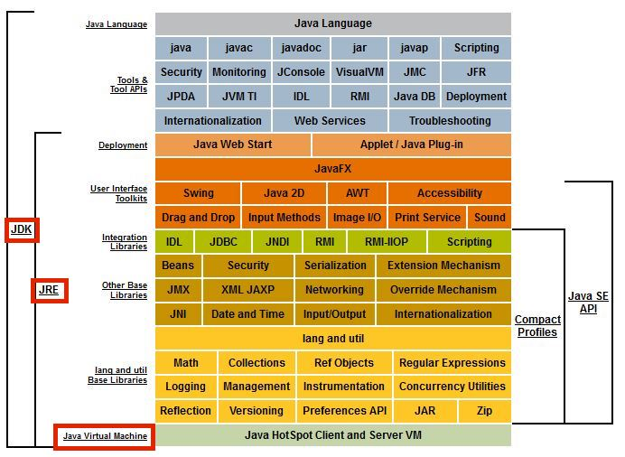

# 1장 자바와 친해지기

사실 저는 자바의 "자"도 모르는 사람이었습니다. 이번에 한 번 열심히 알아가보겠습니다.

## 1.1 들어가며

자바는 많은 장점이 있습니다.

- 엄격한 구조를 갖춘 객체지향 프로그래밍
- 하드웨어 플랫폼이라는 족쇄를 제거하여, "Write once, run anywhere"를 실현
- 메모리 관리 시스템이 있어 메모리 누수 문제와 엉뚱한 메모리를 가리키는 문제를 "대부분" 회피
- 런타임에 핫코드 감지, 컴파일하고 최적화하여 자바 애플리케이션이 최상의 성능을 내도록 함
- 표준 API가 풍부하고 많은 기업과 오픈 소스 커뮤니티에서 제공하는 다양한 기능의 서드 파티 라이브러리 활용

이러한 장점을 활용하는 수준이 아니라, 기술적 특성이 어떻게 활용되고 구현되었는지 이해를 해봅시다.

## 1.2 자바 기술 시스템

자바 기술 시스템은 다음 요소를 포함합니다.

- 자바 프로그래밍 언어
- (다양한 하드웨어 플랫폼용) 자바 가상 머신 구현
- 클래스 파일 포맷
- 자바 클래스 라이브러리 API(표준 API)
- 서드 파티 클래스 라이브러리

자바 프로그래밍 언어, 자바 가상 머신, 자바 클래스 라이브러리를 묶어 JDK라고 합니다. JDK는 자바 개발에 필요한 최소한의 환경입니다.

자바 SE API와 자바 가상 머신, 배포 기술을 묶어 JRE라고 합니다.

책에 있는 그림은 JDK 7시절이라는데 해당 이미지는 언제 버전인지는 잘 모르겠습니다. 전체적인 구성을 그리는데만 사용하겠습니다.

자바가 활용되는 분야 또는 기술이 집중하는 핵심 비즈니스로 나누면 다음과 같이 나눌 수 있습니다.

- 자바 카드 : 스마트 카드와 같은 소형 기기 및 변조 방지 보안 칩등에서 실행되는 자바 플랫폼
- 자바 ME : 휴대 전화, PDA같은 모바일 기기에서 실행되는 자바 프로그램용 플랫폼
- 자바 SE : 데스크톱 애플리케이션용 자바 플랫폼
- 자바 EE : ERP, MIS, CRM 애플리케이션과 같은 다중 계층 구조로 이루어진 기업 규모 애플리케이션용 자바 플랫폼 JDK 10부터는 관리 주체가 이클랩스 재단으로 바뀌면서 자카르타 EE로 개명

현 시점에서는 나누는 게 크게 의미 없습니다. 자바 SE를 제외하고는 힘을 잃어 가고 있기 때문입니다.

## 1.3 자바의 과거와 현재

자바도 나이가 꽤 있는 언어입니다. 변천사 정도는 가볍게 알아두면 좋아보이네요.

썬에서 오라클로 옮겨가는 과정, 오라클이 구글 고소하는 썰, JDK별 기능을 기술해뒀으니 읽어보시는 것을 추천드립니다.

## 1.4 자바 가상 머신 제품군

자바 가상 머신의 개발 궤적과 역사적으로 중요한 변화 과정에 대해 설명합니다.

### C, C++보다 느린이유

JDK 1.0에 포함된 가상 머신을 클래식 VM이라고 합니다. 이 가상 머신은 자바 코드를 순전히 인터프리터 방식으로 실행합니다.
JIT 컴파일러를 사용하려면 플러그인을 추가하면 되는데, 플러그인하는 순간 가상 머신의 실행 시스템 전체가 JIT 컴파일러에 넘어갑니다. 즉, 인터프리터가 더 이상 동작하지 않는겁니다.

당시 인터프리터와 컴파일러는 함께 구동하지 않았기에 컴파일러를 사용하기 시작하면 실행 빈도 등 컴파일러에 따른 득실과 상관없이 '코드 전체'를 컴파일 해야 했습니다. 그래서 자칫하면 프로그램 응답 속도가 너무 느려져 오래 걸리는 최적화 기법은 적용할 수 없었습니다.

JIT 컴파일러로 네이티브 코드를 만들어 냈음에도 C, C++ 프로그램보다 실행 효율이 나쁠 수 밖에 없었습니다.

JIT(Just-In-Time) 컴파일러와 AOT(Ahead-Of-Time) 컴파일러 차이에 대해서도 공부하면 좋아보입니다.

### 이그잭트 VM

이런 문제를 개선하기 위해 JDK 1.2에서 이그잭트 VM을 만들어냈습니다. 핫스팟 검출, 2단계 JIT 컴파일러, 컴파일러와 인터프리터 혼합 모드 등을 갖추고 있습니다.

이그잭트 VM은 정확한 메모리 관리(Exact memory management)에서 따왔습니다. 가상 머신이 메모리의 특정 위치에 있는 데이터의 구체적인 자료형을 알 수 있다는 의미입니다.

이 덕분에 핸들에 기초한 클래식 VM의 객체 검색 방식에서 벗어날 수 있었고, 성능이 크게 개선되었습니다.

하지만 핫스팟 VM에 밀려 크게 주목받진 못했습니다.

### 핫스팟 VM

핫스팟 VM을 처음들어보는 자바 개발자는 없을 것이라는데, 저는 처음 들어봤습니다 ㅋㅋ;;

OpenJDK의 기본 가상 머신이자 가장 널리 사용되는 JVM이라고 합니다.

핫 코드 감지가 들어가 있어 이름도 핫스팟 VM이라고 합니다. 핫 코드 감지는 '컴파일했을 때 효과를 가장 크게 볼 수 있는 코드 영역'을 런타임에 알아내어 JIT 컴파일러에 전달해줍니다. 그러면 JIT 컴파일러가 해당 코드를 메서드 단위로 컴파일합니다. 메서드가 자주 호출되거나 메서드 안에 시간을 많이 잡아 먹는 for문이 있다면 JIT 컴파일을 수행해 스택을 치환합니다. 이처럼 런타임에 스택을 치환하는 기숭를 온스택 치환(OSR)이라고 합니다.

이런식으로 컴파일러와 인터프리터가 조화롭게 협력해 프로그램 응답 속도와 실행 성능 사이의 균형을 잡아줍니다.

### 임베디드 VM

모바일과 임베디드 시장에 특화한 JVM입니다. 크게 쇠퇴한 부류입니다.

### 이인자 : BEA JRockit과 IBM J9 VM

앞서 소개한 JVM은 썬과 오라클에서 만든 JVM인데, 썬과 오라클 외 조직에서도 만든 JVM이 있습니다. BEA의 JRockit과 IBM의 J9 VM입니다.

---

그외에도 매우많은 JVM이 있지만, 사장된 JVM이 많아 따로 적진 않겠습니다.

## 1.5 자바 기술의 미래

자바가 미래를 어떻게 대비하고 있는지 알아보겠습니다.

### 1.5.1 언어 독립

자바를 대체할 언어들이 많이 등장하고 있습니다. 코틀린, Golang, JS, Python 등이 자주 언급됩니다. 2020년대에 들어서 자바는 살짝 주춤하는 상태입니다.

모든 분야를 지배할 수 있는 언어는 없습니다.

2018년 4월 오라클은 그랄VM이라는 새로운 기술을 "어디서든 더 빠르게 실행한다(Run programs faster anywhere)" 라는 구호와 함께 발표했습니다.

그랄VM은 핫스팟 가상 머신 위에 구축된 크로스 언어 풀스택 가상 머신입니다. 자바, 코틀린, 스칼라, 그루비같은 자바 가상 머신 언어들은 물론 LLVM 기반 컴파일러를 사용하는 C, C++, 러스트. 그 외 JS, 루비, Python, R까지도 지원합니다. 그랄VM에서는 추가 비용없이 이 언어들을 혼합해 사용할 수 있습니다.

그랄 VM은 기본적으로 각종 언어의 소스코드나 컴파일된 중간 형식을 인터프리터를 통해 그랄VM이 이해할 수 있는 중간 표현(IR)으로 변환하는 식으로 작동합니다.

그랄VM은 JVM으로 활용할 수 있습니다. 핫스팟을 기반으로 탄생했으며, 자바 SE와 완벽히 호환됩니다. JIT 컴파일러에 차이가 있으며, 실행 효율과 컴파일 품질 모두 표준 핫스팟보다 나은 것으로 평가됩니다.

### 1.5.2 차세대 JIT 컴파일러

서버용 제품처럼 장기간 운용되는 애플리케이션에서는 자주 실행되는 핫 코드를 탐지하여 네이티브 코드로 컴파일합니다. 이런 유형의 자바 애플리케이션은 JIT 컴파일러의 출력 품질이 실행 효율을 크게 좌우할 수 밖에 없습니다.

핫스팟은 기본적으로 JIT 컴파일러를 2개 내장하고 있습니다. 하나는 컴파일 속도가 빠른 대신 최적화를 적게 하는 클라이언트 컴파일러(C1 컴파일러)이고, 다른 하나는 컴파일 속도는 느리지만 더 많은 최적화를 적용하는 서버 컴파일러(C2 컴파일러)입니다.

JDK 10부터는 그랄 컴파일러가 추가되었습니다. 그랄VM 프로젝트의 일환으로 만들어진 기술이빈다. C2 컴파일러를 대체할 목적으로 핫스팟에 도입되었습니다. JDK 16부터는 개발과 관리 효율을 높이고자 그랄 컴파일러를 JDK에서 독립시켜 그랄VM으로 터전을 옮겼습니다.

### 1.5.3 네이티브를 향한 발걸음

장시간 실행할 필요가 없거나 크기가 작은 애플리케이션의 경우 자바로 개발하면 본질적인 단점이 몇 가지 있습니다. "Hello World"를 출력하려해도 100MB가 넘는 JRE가 필요하다는 점도 있지만, 애플리케이션 아키텍처가 거대한 단일 아키텍처에서 작은 마이크로서비스 아키텍처로 옮겨가고 있다는 점입니다.

MSA에서는 분할된 서비스 각각이 더 이상 수십에서 수백GB의 메모리를 쓸 일이 없습니다. 서버리스 아키텍처에서는 이러한 모순이 더 드러납니다. 함수는 서비스보다도 크기가 작고 실행 시간이 짧습니다.

이러한 시대의 흐름을 따라가기 위해 자바는 애플리케이션 클래스 데이터 공유(AppCDS, 로딩한 클래스 정보를 캐시해 두어 다음번 구동 시간을 줄이는 기술)와 노옵(no-op) 가비지 컬렉터 엡실론(메모리를 할당만 해주고 회수는 하지 않는 컬렉터로, 간단한 작업을 빠르게 처리한 후 즉시 종료하는 애플리케이션에 적합) 등의 기술을 포함시켰습니다.

AOT 컴파일러를 도입하려는 움직임도 있었습니다. 하지만 자바의 철학인 WORA와 반대되기도 합니다. JDK 9 ~15에 jaotc라는 이름으로 도입되긴 했지만 성능은 좋지 않았다고 합니다.

기대에 부응하기위해 서브스트레이트 VM이 등장했습니다. 사전 컴파일된 네이티브 코드를 핫스팟 가상 머신 없이 실행하는 기술로, 독자적인 예외 처리, 스레드 관리, 메모리 관리, 자바 네이티브 인터페이스 접근 메커니즘 등을 갖춘 작은 런타임 환경입니다.

그랄VM은 서브스트레이트 VM과 사용자 프로그램을 하나로 묶어 프로그램으로부터 도달 가능한 코드만 추려 네이티브 이미지에 담습니다. 또한 이 과정에서 초기화까지 수행하여 최종 실행 파일이 생성되면 초기화된 힙 스냅숏을 저장합니다. 이런 식으로 JVM이 수행하던 초기화 과정을 건너뛰고 프로그램을 곧바로 실행하여 초기 구동 시간을 획기적으로 줄였습니다.

이 방식이 가능하려면 프로그램이 완결된 형태여야 합니다. 컴파일러가 찾을 수 없는 코드나 클래스 라이브러리를 동적으로 읽어들일 수 없다는 뜻입니다.

서브스트레이트 VM은 메모리 사용량도 크게 줄였습니다.

### 1.5.4 유연한 뚱뚱이..??

핫스팟은 다양한 분야의 애플리케이션을 지원하도록 만들어진 JVM입니다. 너무 많은 것을 요구당하고, 이를 수용하기 위해 지속적으로 모듈화하고 확장성을 키우기 위해 리팩토링하고 있다고 합니다.

핫스팟 JVM은 컴파일을 할 때 원하는 기능을 지정하여 맞춤형 가상 머신을 만들 수 있습니다.

JDK 1.4에서는 가상 머신 내부 정보를 알려주기 위해 가상 머신 명세에 정의되지 않은 프로파일러 인터페이스(JVMPI)와 디버그 인터페이스(JVMDI)를 제공합니다.

JDK 5는 모든 형태의 자바 가상 머신 관련 도구를 프로그래밍 인터페이스를 모아 추상화한 고수준 인터페이스 JVMTI를 도입했습니다.

JDK 9에서는 자바 언어 수준의 컴파일러 인터페이스인 JVMCI가 도입되어 가상 머신 외부에서 JIT 컴파일러를 추가하거나 교체할 수 있게 되었습니다.

JDK 10에서는 가비지 컬렉터 인터페이스를 리팩토링하여 내부 컬렉터들이 일관되게 동작하도록 했습니다. 이 작업으로 인해 JDK 12에서 오라클이 아닌 회사에서 개발한 셰넌도어 컬렉터를 핫스팟에 추가할 수 있었고, JDK 14에서는 CMS 컬렉터를 제거할 수 있었습니다.

연이은 리팩토링과 개방을 거쳐 핫스팟 가상 머신은 시간의 침식으로부터 점점 자유로워지고 있습니다.

개방성과 확장성이 좋아지면서 바깥 세상과 연동하기 쉬운 플랫폼이 되었습니다.

### 1.5.5 언어 문법의 지속적인 개선

상대적으로 가장 덜 중요한 개선이라고 합니다. 인간 친화적이지 않은 JS는 큰 성공을 했고, 자바보다 문법이 우아한 C#은 아직도 자바를 못따라오고 있습니다. 언어 문법이 성공을 가르는 제 1 원칙은 아니라는 이야기 입니다.

그래도 언어가 제공하는 기능과 문법은 생산성과 개발 효율에 많은 영향을 주는 요인이긴 합니다.

책에 있는 것만 간단하게 정리해보았습니다.

- JDK 10 : 지역 변수 타입 추론(var 키워드)
- JDK 11 : 람다식 매개 변수로 사용할 수 있도록 지역 변수 구문 개선
- JDK 14 : switch문을 표현식으로 사용할 수 있는 문법 추가
- JDK 15 : text block 추가
- JDK 16 : 패턴 매칭 능력을 부여해 instanceof 연산자 표현력 강화 / record 타입 추가
- JDK 17 : 자신을 확장하거나 구현할 수 있는 클래스와 인터페이스를 제한하는 봉인된 클래스 / 봉인 인터페이스 타입 추가
- JDK 21 : 레코드 클래스로부터 데이터를 가져올 때 패턴 매칭 제공 / switch문, 표현식의 패턴 매칭 능력 개선

진행중인 개선안들도 있습니다. 미리 보기 형태로 JDK에 포함되어 원하면 사용해볼 수 있습니다.

편의 문법 외의 언어 기능도 다방면에서 지속적으로 개선되고 있습니다.

- 발할라 프로젝트 : 값 타입과 원시 타입을 일반화한 제네릭 타입을 제공하고, 불변 타입과 비참조 타입을 명시적으로 선언할 수 있게 합니다.
- 파나마 프로젝트 : JVM과 네이티브 코드의 경계를 허무는 작업입니다. 자바 코드는 JNI를 이용해 네이티브 코드를 호출할 수 있으나, 이용하기 번거롭고 빈번하게 호출시 성능 부하도 큽니다. 파나마 프로젝트는 자바 코드와 네이티브 코드가 어우러지는 방법을 제공합니다.
  - 외부 함수 및 메모리 API : 힙 바깥 메모리를 사용하기 위한 API.
  - 벡터 API : 하드웨어로 가속되는 벡터 계산 기능 제공
  - Jextract : 네이티브 라이브러리 헤더와 자바를 바인딩해 주는 도구

자바는 6개월마다 새로운 버전의 JDK를 배포하면서 다른 언어의 기능을 흡수할 것입니다.
