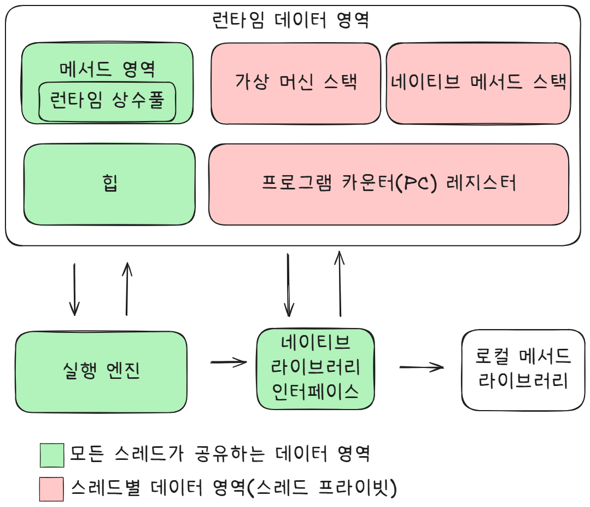
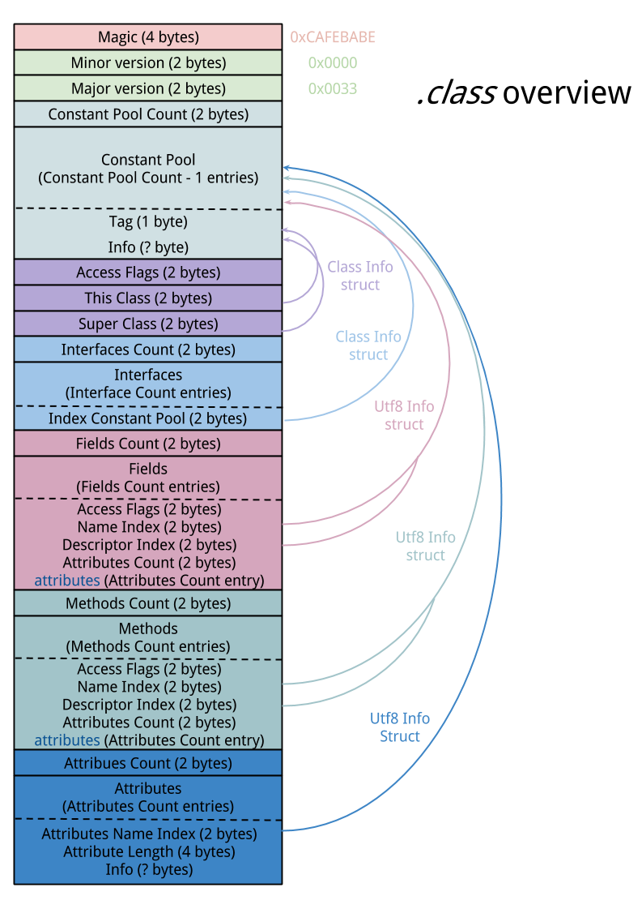
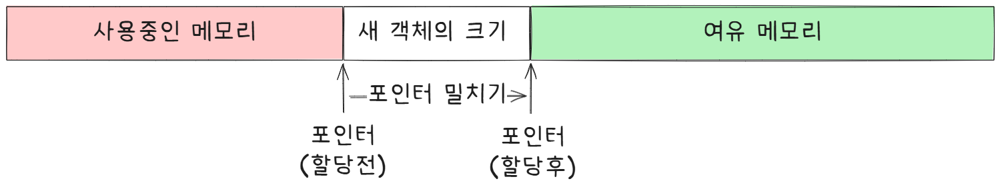
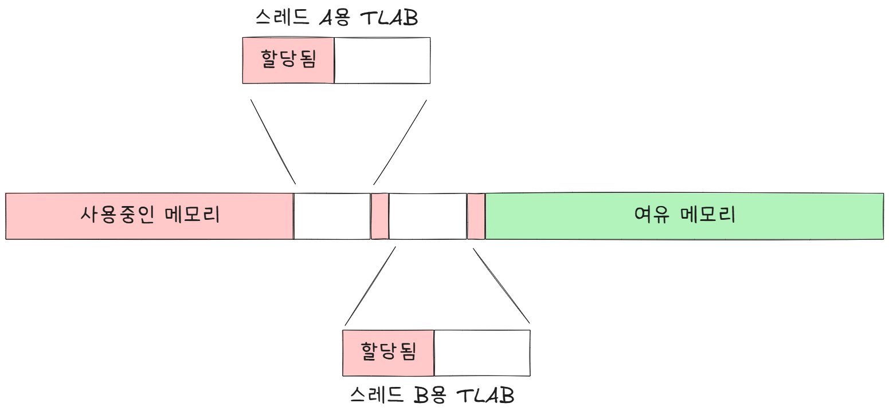
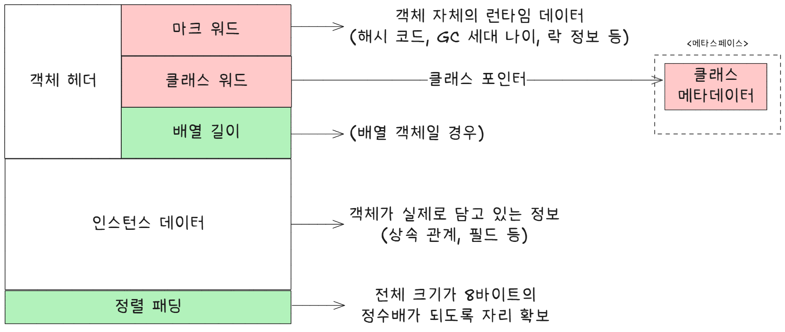
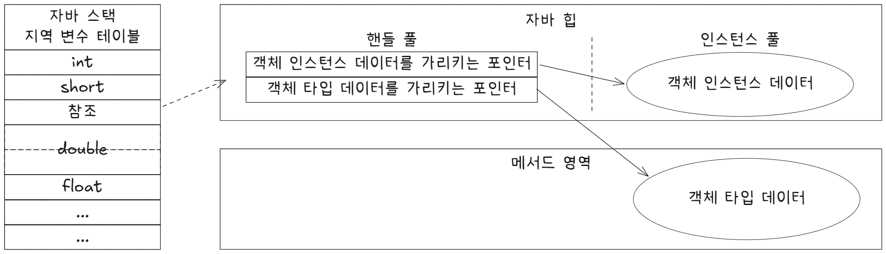
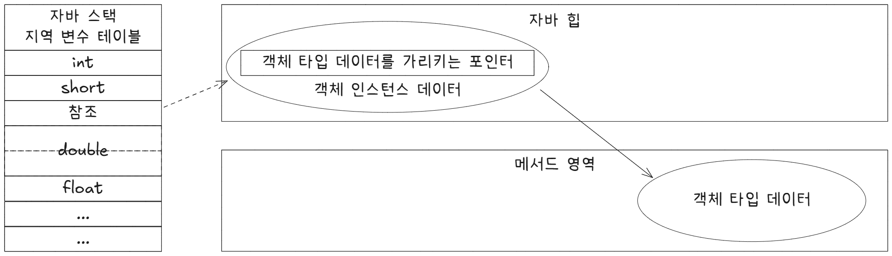
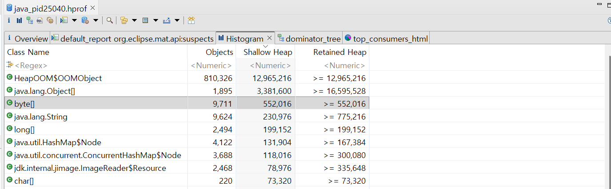
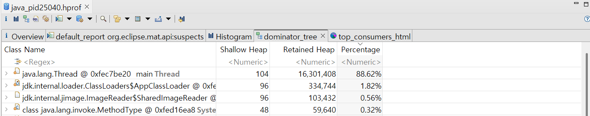
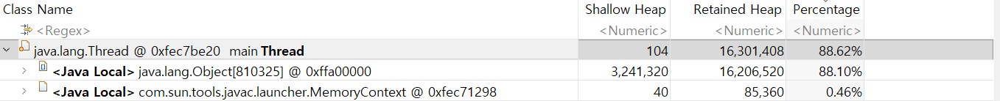

# 2장 : 자바 메모리 영역과 메모리 오버플로

## 2.1 들어가며

자바의 C·C++과의 큰 차이점은 가상 머신이 메모리 관리를 대신해준다는 점입니다. 하지만 통제권을 위임하다보니 문제가 생겼을 때 가상 머신의 메모리 관리 방식을 이해하지 못하면 문제 해결하기가 어렵습니다.

2장에서는 JVM이 관리하는 다양한 메모리 영역을 알아보고, 각 영역이 수행하는 역할과 관리 대상, 발생가능한 문제에 대해 알아보겠습니다.

## 2.2 런타임 데이터 영역

JVM은 자바 프로그램이 실행되는 동안 필요한 메모리를 몇 개의 데이터 영역으로 나누어 관리합니다. 각각의 영역은 목적과 생성/삭제 시점이 있습니다.

《자바 가상 머신 명세》에 따르면 다음 그림과 같은 런타임 데이터 영역으로 구성됩니다.



### 2.2.1 프로그램 카운터

프로그램 카운터 레지스터는 작은 메모리 영역으로, 현재 실행 중인 스레드의 '바이트 코드 줄 번호 표시기'라고 생각하면 쉽습니다.

프로그램의 제어 흐름, 분기, 순환, 점프 등을 표현합니다. 예외 처리나 스레드 복원 같은 모든 기본 기능에 이용됩니다.

JVM의 멀티스레딩은 CPU 코어를 여러 스레드가 교대로 사용하는 방식으로 구현됩니다. 스레드 전환 후 이전에 실행하다 멈춘 지점을 정확하게 복원하려면 각 스레드는 고유한 프로그램 카운터가 필요합니다. 이런 값은 스레드가 서로 영향을 주지 않는 독립된 영역인 **스레드 프라이빗 메모리**에 저장됩니다.

스레드가 네이티브 메서드를 실행중일 때는 PC 값은 `Undefined`입니다. PC 메모리 영역은 `OutOfMemoryError` 조건이 명시되지 않은 유일한 영역이기도 합니다.

### 2.2.2 자바 가상 머신 스택

PC처럼 JVM 스택도 스레드 프라이빗하며, 연결된 스레드와 생성/삭제 시기가 일치합니다. JVM 스택은 자바 메서드를 실행하는 스레드의 메모리 모델을 설명해 줍니다.

각 메서드가 호출될 때마다 JVM은 스택 프레임을 만들어 지역 변수 테이블, 피연산자 스택, 동적 링크, 메서드 반환값 등의 정보를 저장합니다.

이렇게 만든 스택 프레임을 JVM 스택에 푸시하고 메서드가 끝나면 팝하는 일을 반복합니다.

자바의 메모리 영역을 힙 메모리 / 스택 메모리로 구분하는 사람이 많은데, 이 구분법은 C·C++에서 기인한 방법으로 자바의 메모리 영역을 설명하는 것에는 한계가 있습니다.

'스택 메모리'라 하면 보통은 이 JVM 스택을 가리키는데, 그 중에서 특히 지역 변수 테이블을 가리키는 경우가 많습니다.

#### 지역 변수 테이블

JVM이 컴파일타임에 알 수 있는 다양한 기본 데이터 타입, 객체 참조, 반환 주소 타입을 저장합니다. 이 데이터 타입들을 저장하는 공간을 **지역 변수 슬롯**이라고 합니다. 기본적으로 슬롯 하나의 크기는 32비트이며 double 타입처럼 길이가 64비트라면 2칸을 차지합니다.

지역 변수 테이블을 구성하는 데 필요한 데이터 공간은 컴파일 과정에서 할당됩니다. 메서드 실행 중에는 절대 변하지 않습니다.

《자바 가상 머신 명세》는 스택 메모리 영역에서 2가지 오류가 발생할 수 있도록 정의했습니다.

1. `StackOverflowError` : 스레드가 요청한 스택 깊이가 가상 머신이 허용하는 깊이보다 클 경우
2. `OutOfMemoryError` : 스택을 확장하려는 시점에 여유 메모리가 충분하지 않은 경우

### 2.2.3 네이티브 메서드 스택

JVM 스택과 비슷한 역할을 합니다. JVM 스택은 자바 메서드(바이트코드)를 실행할 때 사용하고 네이티브 메서드 스택은 네이티브 메서드를 실행할 때 사용합니다.

《자바 가상 머신 명세》에는 어떤 구조인지, 어떻게 표현해야 하는지, 아무것도 명시하지 않아 자유롭게 구현이 가능합니다. 핫스팟 포함 두 스택을 합쳐놓은 가상 머신도 있습니다.

### 2.2.4 자바 힙

애플리케이션이 사용할 수 있는 가장 큰 메모리입니다. 자바 힙은 모든 스레드가 공유하며 VM이 구동될 때 만들어집니다.

이 영역의 유일한 목적은 객체 인스턴스를 저장하는 것입니다.

> '거의' 모든 객체 인스턴스가 저장된다고 표현하는데, 기존에는 모든 객체 인스턴스가 자바 힙에 저장되는 것이 맞았습니다. 하지만 기술의 발전하며 스택 할당과 스칼라 치환 최적 방식이 달라지며 모든 자바 객체 인스턴스가 저장된다는 설명이 애매해지고 있습니다.

자바 힙은 GC가 관리하는 메모리 영역입니다. 메모리 회수 관점에서 대다수의 현대적인 가비지 컬렉터는 세대별 컬렉션 이론을 기초로 설계합니다. 자바 힙의 영역 구분은 따라야 하는 가이드가 없이 자유롭게 구현 가능합니다.

메모리 할당 관점에서 자바 힙은 모든 스레드가 공유합니다. 따라서 객체 할당 효율을 높이기 위해 스레드 로컬 할당 버퍼 여러 개로 나눕니다. 메모리 회수와 할당을 빠르게 하기 위함입니다.

> TLAB(Thread-Local Allocation Buffer)이란, 멀티스레드 환경에서 힙 메모리에 객체를 할당할 때 발생하는 스레드 간의 경합(Lock)과 병목 현상을 방지하기 위해, 에덴(Eden) 영역 안에 각 스레드 전용으로 할당해 주는 독점적 메모리 버퍼입니다.

자바 힙은 크기를 고정할 수도, 확장할 수도 있게 구현합니다. 새로운 인스턴스에 할당해줄 힙 공간이 부족하고 확장할 수 없다면 `OutOfMemoryError`가 발생합니다.

### 2.2.5 메서드 영역

메서드 영역도 모든 스레드가 공유하는 영역입니다. 가상 머신이 읽어 들인 타입 정보, 상수, 정적 변수, JIT 컴파일러가 컴파일한 코드 캐시를 저장하는 데 사용합니다.

메서드 영역도 논리적으로는 힙의 한 부분으로 기술하지만, 자바 힙과 구분하기 위해 논힙이라고 부르기도 합니다.

> 메서드 영역 vs 영구 세대
>
> 핫스팟 JVM 개발 팀이 가비지 컬렉터의 수집 범위를 메서드 영역으로 확장하기로 하여서 메서드 영역을 영구 세대에 구현했을 뿐입니다. 그 결과 핫스팟의 가비지 컬렉터는 메서드 영역도 자바 힙처럼 관리할 수 있었고 메서드 영역을 관리하는 코드가 필요없어 작업량을 줄일 수 있었습니다.
>
> 하지만 이 설계 때문에 메모리 오버플로우를 겪을 가능성이 커졌습니다. 결국 미래를 위해 영구 세대를 포기하고 점진적으로 메서드 영역을 네이티브 메모리에 구현할 계획을 세웁니다.
>
> JDK 7에서는 영구 세대에서 관리하던 문자열 상수와 정적 변수 등의 정보를 자바 힙으로 옮깁니다.
> JDK 8에서는 영구 세대 개념을 없애고 네이티브 메모리에 메타스페이스를 구현하게 됩니다.

《자바 가상 머신 명세》에는 메서드 영역에 대한 제약이 거의 없습니다. 이 영역에서는 쓰레기를 회수할 일이 거의 없습니다. 회수 대상이 대부분 상수 풀과 타입이라서 회수 효과가 상대적으로 적습니다.

JVM의 명세와 메서드 영역을 구현하는 방식이 많이 헷갈려 간단하게 정리해보았습니다.

```
JDK 7 이전
Heap
 └─ 객체

PermGen (Method Area 구현체)
 ├─ 클래스 메타데이터
 ├─ static 변수 (JDK 7버전부터 Heap으로 이동)
 ├─ Runtime Constant Pool
 └─ String Intern Pool
```

```
JDK 8 이후

Heap
 ├─ 객체
 ├─ static 변수
 └─ String Pool

Metaspace (Method Area 구현체)
 ├─ 클래스 메타데이터
 ├─ 메서드 정보
 ├─ 필드 정보
 ├─ 바이트코드
 └─ Runtime Constant Pool
```

### 2.2.6 런타임 상수 풀

런타임 상수 풀은 메서드 영역의 일부입니다. 상수 풀 테이블에는 클래스 버전, 필드, 메서드, 인터페이스 등 클래스 파일에 포함된 설명 정보에 더해 컴파일타임에 생성된 리터럴과 심벌 참조가 저장됩니다.

JVM은 클래스 파일의 각 영역별로 엄격한 규칙을 정해 놓습니다. 예컨대 가상 머신이 클래스 파일을 로드해 실행하려면 각 바이트에는 명세가 요구하는 데이터가 들어 있어야 합니다. 다만 런타임 상수 풀에 대해서는 요구 사항을 상세하게 정의하지 않아서 가상 머신 제공자가 자유롭게 구현할 수 있습니다.



클래스 파일이 지켜야 하는 명세 입니다. CAFE BABE의 유래에 대해서도 찾아보면 재밌으니 시간이 있다면 찾아보는 것을 추천합니다.

클래스 파일의 상수 풀과 비교했을 때 런타임 상수 풀은 동적이라는 점이 중요한 특징입니다.
런타임에도 런타임 상수 풀에는 상수가 추가될 수 있습니다.

> 개발자들이 많이 사용하는 `String` 클래스의 `intern()` 메서드에 특성이 반영되어 있다고 합니다. 저는 써본 적이 없으니 가짜 개발자 였습니다.

런타임 상수 풀은 메서드 영역에 속하므로 당연히 메서드 영역을 넘어서게 확장이 불가능합니다. 그래서 상수 풀의 공간이 부족하면 `OutOfMemoryError`가 발생합니다.

### 2.2.7 다이렉트 메모리

다이렉트 메모리는 가상 머신 런타임에 속하지 않으며, 《자바 가상 머신 명세》정의된 영역도 아닙니다. 하지만 자주 쓰이는 메모리 영역입니다.

JDK 1.4에서 NIO가 도입되며 채널과 버퍼 기반 I/O 메서드가 소개되었습니다. NIO는 힙이 아닌 메모리를 직접 할당할 수 있는 네이티브 함수 라이브러리를 이요하며, 이 메모리에 저장되어 있는 `DirectByteBuffer` 객체를 통해 작업을 수행할 수 있습니다. 이로 인해 자바 힙과 네이티브 힙 사이에 데이터를 주고받지 않아도 돼서 **일부 시나리오**에서 성능을 크게 개선했습니다.

> 일부 시나리오 ??
>
> NIO가 유리한 경우: 연결된 클라이언트 수는 엄청나게 많은데, 각 클라이언트가 보내는 데이터의 양은 적고 산발적인 경우 (예: 채팅 서버, 알림 서버, 웹소켓 기반 서비스).
>
> 기존 IO가 유리한 경우: 연결된 클라이언트 수는 적은데, 한 번 연결되면 엄청나게 큰 대용량 파일 데이터를 끊임없이 주고받는 경우 (예: 대용량 파일 업로드/다운로드 서버). 논블로킹 제어 비용보다 대용량 데이터를 순차적으로 밀어 넣는 스트림 방식이 더 안정적이고 코딩하기도 쉽습니다.
>
> Netty와 Spring WebFlux가 NIO 기반이라고 합니다.

물리 메모리를 직접 할당하기 때문에 이 역시 한계를 넘어서면 `OutOfMemoryError`가 발생합니다.

## 2.3 핫스팟 가상 머신에서의 객체 들여다보기

앞서 알아봤듯 JVM의 구현은 자유로운 부분이 많기 때문에 특정 가상 머신과 특정 메모리 영역으로 범위를 좁혀 시작해보겠습니다. 가장 보편적인 가상 머신(핫스팟)과 가장 보편적인 메모리 영역(자바 힙)을 예로 설명하겠습니다.

### 2.3.1 객체 생성

자바로 객체 생성을 할 떄는 보통 `new` 키워드만 쓰면 끝납니다. `new`를 사용했을 때 가상 머신 수준에서는 어떤 과정을 거쳐 객체(배열, Class 객체를 제외한 일반 객체)가 만들어질까요?

JVM이 `new`에 해당하는 바이트코드를 만나면 다음과 같은 단계를 거칩니다.

1. 이 명령의 매개 변수가 상수 풀 안의 클래스를 가리키는 심벌 참조인지 확인합니다.
2. 심벌 참조가 뜻하는 클래스가 로딩, 해석(resolve), 초기화(initialize)되었는지 확인합니다.
   - 준비되지 않은 클래스라면 로딩부터 합니다.(7장)
3. 로딩이 완료된 클래스라면 객체를 담을 메모리를 할당합니다. 메모리 크기는 클래스를 로딩하고 나면 알 수 있습니다.

자바 힙이 완벽히 규칙적이라고 가정하면 사용 중인 메모리는 한쪽에, 여유 메모리는 반대편에 자리하며, 포인터는 두 영역의 경계를 가리키게 될 것 입니다. 이 상태에서 메모리를 할당한다면 포인터를 여유 공간 쪽으로 객체 크기 만큼 이동시킵니다. 이러한 할당 방식을 포인터 밀치기(bump the pointer)라고 합니다.



하지만 자바 힙은 규칙적이지 않습니다. 사용 중인 메모리와 여유 메모리가 뒤섞여 있어 포인터를 쉽게 이동시킬 수 없습니다.

대신 가상 머신은 가용 메모리 블록들을 목록으로 따로 관리하며, 객체 인스턴스를 담기에 충분한 공간을 찾아 할당한 후 목록을 갱신합니다. 이러한 방식을 여유 목록(free list)이라 합니다.

사용하는 가비지 컬렉터가 컴팩트(compact)를 할 수 있다면 자바 힙을 규칙적으로 관리할 수 있습니다. 시리얼, 파뉴처럼 컴팩트가 된다면 단순하고 효율적인 포인터 밀치기 방식을 채택하고 이론상의 CMS처럼 스윕 알고리즘을 채택했다면 여유 목록 방식을 사용합니다.

멀티 스레딩 환경에서의 동시성 문제도 있습니다. 자바 힙은 스레드 공유 영역이므로 포인터 위치를 수정하는 것도 스레드 안전하지 않아 여러 스레드가 동시에 객체를 생성하려고 할 때 문제가 생길 수 있습니다. 해법은 2가지가 있습니다.

1. 메모리 할당을 동기화 : 비교 및 교환(CAS)과 실패 시 재시도 방식의 가상 머신은 갱신을 원자적으로 수행할 수 있습니다.
2. 스레드마다 다른 메모리 공간 할당 : 스레드 각각이 자바 힙 내에 작은 크기의 전용 메모리를 미리 할당받습니다. 이런 메모리를 스레드 로컬 할당 버퍼(TLAB) 라고 합니다. 각 스레드는 로컬 버퍼에서 메모리를 할당 받아 사용하다가 버퍼가 부족하면 그 때 동기화를 해 새로운 버퍼를 할당 받습니다.



메모리 할당이 끝났으면 가상 머신은 할당받은 공간을 0으로 초기화합니다. 자바에서 객체의 인스턴스 필드를 초기화하지 않고도 사용할 수 있는 이유가 바로 이 단계 때문입니다.

다음 단계로 JVM은 각 객체에 필요한 설정을 합니다. 어느 클래스의 인스턴스인지, 클래스의 메타 정보는 어떻게 찾는지, 객체의 해시 코드는 무엇인지 GC 세대 나이(age)는 얼마인지 등의 정보가 여기 속합니다. 이런 정보는 객체의 객체 헤더에 저장됩니다.

이상의 과정이 끝났다면 가상 머신 관점에서는 새로운 객체가 다 만들어진 겁니다. 하지만 자바 프로그램 관점에서는 생성자(\<init\>() 메서드)가 실행되지 않았고 모든 필드도 기본값인 0 상태입니다.

> 자바 컴파일러는 `new`키워드를 발견하면 바이트 코드 명령어인 `new`와 `invokespecial`로 변환합니다. `new`는 JVM 관점에서 객체 생성(메모리 할당) `invokespecial`은 자바 프로그램 관점에서 객체 생성(생성자 실행)을 담당합니다.

### 2.3.2 객체의 메모리 레이아웃

핫스팟은 객체를 세 부분으로 나누어 힙에 저장합니다. 객체 헤더, 인스턴스 데이터, 정렬 패딩입니다.



#### 객체 헤더

핫스팟은 객체 헤더에 두 유형의 정보를 담습니다. 첫 번째 유형은 객체 자체의 런타임 데이터입니다. 해시 코드, GC 세대 나이, 락 상태 플래그, 스레드가 점유한 락들, 편향된 스레드의 아이디, 편향된 시각의 타임스탬프 등입니다. 이 부분을 **마크 워드(Mark word)**라고 하며 차지하는 크기는(참조 압축 기능을 켜지 않으면) 32비트 가상 머신은 32비트, 64비트 가상머신은 64비트 입니다.

객체는 아주 많은 런타임 데이터를 필요로 하여 32/64 비트 구조에 다 담을 수 없습니다. 객체 자체가 정의한 데이터와 관련없는 정보까지 담아야 해서 한정된 메모리를 최대한 효율적으로 사용해야 합니다. 그래서 마크 워드의 데이터 구조는 동적으로 의미가 달라집니다. 락 플래그에 따라 저장하는 내용이 동적으로 바뀐다는 의미입니다.

클래스 워드(klass word, 오타 아님)는 객체의 클래스 관련 메타데이터를 가리키는 클래스 포인터가 저장됩니다. JVM은 이 포인터를 통해 특정 객체가 어느 클래스의 인스턴스인지 런타임에 알 수 있습니다. 모든 가상 머신 구현이 클래스 포인터를 객체 헤더에 저장하진 않습니다.

자바 배열의 경우 배열 길이도 객체 헤더에 저장합니다. JVM은 객체 헤더의 메타데이터로부터 객체의 크기를 알 수 있지만, 배열의 크기까지 알아야 배열 객체가 차지하는 메모리 크기를 제대로 계산할 수 있기 때문입니다.

#### 인스턴스 데이터

객체가 실제로 담고 있는 정보입니다. 프로그램 코드에서 정의한 다양한 타입의 필드 관련 내용, 부모 클래스 유무, 부모 클래스에서 정의한 필드가 기록됩니다.

정보의 저장 순서는 가상 머신의 할당 전략 매개 변수와 자바 소스 코드에서 필드를 정의한 순서에 따라 달라집니다. 핫스팟은 기본적으로 `long`·`double`, `int`, `short`·`char`, `byte`·`boolean`, 일반 객체 포인터 순으로 할당합니다. 길이가 같은 필드는 같이 할당하고 저장됩니다. 필드 길이가 같다면 부모 클래스에서 정의된 필드가 자식 클래스의 필드보다 앞에 배치됩니다.

#### 정렬 패딩

정렬 패딩은 존재하지 않을 수도 있으며 특별한 의미 없이 자리를 확보하는 역할만 합니다. 핫스팟의 자동 메모리 관리 시스템에서 객체의 시작 주소는 8바이트의 정수배여야 합니다. 즉 모든 객체의 크기가 8바이트의 정수배여야 합니다.

### 2.3.3 객체에 접근하기

대다수의 객체는 다른 객체 여러 개를 조합해 만들어집니다. 자바 프로그램은 스택에 있는 참조 데이터를 통해 힙에 있는 객체에 접근해 이를 조작합니다. 《자바 가상 머신 명세》는 참조 타입을 '객체를 가리키는 참조'로 정했을 뿐 힙에서 객체의 위치를 알아내어 접근하는 방법은 규정하지 않습니다. 이 부분도 결국 구현하기 나름입니다. 주로 핸들이나 다이렉트 포인터를 사용해 구현합니다.

핸들 방식은 자바 힙에 핸들 저장용 풀이 별도로 존재할 것입니다. 참조에는 객체의 핸들 주소가 저장되고 핸들에는 해당 객체의 인스턴스 데이터, 타입데이터, 구조등 정확한 주소 정보가 담길 것입니다.



핸들 방식의 큰 장점은 참조에 '안정적인' 핸들주소가 저장되는 것입니다. 가비지 컬렉션 과정에서 객체가 이동하는 일은 흔하지만, 핸들을 이용하면 객체의 위치가 바뀌는 상황에서도 참조 자체는 손댈 필요가 없습니다. 핸들 내의 인스턴스 데이터 포인터만 바꾸면 됩니다.

---

다이렉트 포인터 방식에서는 자바 힙에 위치한 객체에서 인스턴스 데이터뿐 아니라 타입 데이터에 대한 접근도 제공해야 합니다. 스택의 참조에는 객체의 실제 주소가 바로 저장되어 있습니다.



이 방식의 가장 큰 장점은 속도입니다. 핸들을 경유하는 오버헤드가 없기 때문입니다. 자바에서는 다른 객체에 접근할 일이 많아 오버헤드도 실행 시간에 영향을 크게 줄 수 있습니다.

핫스팟은 주로 다이렉트 포인터 방식을 사용합니다.

## 2.4 실전 : OutOfMemoryError 예외

이번 절에서는 예제 코드를 보면서 실습합니다. JVM의 각종 메모리 영역에 대해 `OutOfMemoryError`가 어떻게 터지는지 확인합니다.

### 2.4.1 자바 힙 오버플로

자바 힙은 객체 인스턴스를 저장하는 공간입니다. 객체를 계속해서 생성하고 객체에 접근할 경로가 살아있다면 언젠가는 힙의 최대 용량을 넘어설 것입니다.

예제 코드는 다음과 같습니다.

```java
import java.util.ArrayList;
import java.util.List;

// VM 매개 변수 : -Xms20m -Xmx20m -XX:+HeapDumpOnOutOfMemoryError

public class HeapOOM {
    static class OOMObject {

    }

    public static void main(String[] args) throws Exception {
        List<OOMObject> list = new ArrayList<OOMObject>();

        while (true) {
            list.add(new OOMObject());
        }
    }
}
```

`java -Xms20m -Xmx20m -XX:+HeapDumpOnOutOfMemoryError .\HeapOOM.java`를 사용하여 힙 크기의 최대/최소를 20mb로 제한하고 OOM 발생시 힙덤프를 생성하게 합니다.

---

힙 덤프의 분석은 이클립스 MAT로 진행하였습니다.

제가 진행한 실습 환경은 다음과 같습니다. 회사마다, JVM마다 구현이 상이하니 참고 정도만 해야할듯 싶습니다.

```
java.version : 23.0.2
java.vm.name : Java HotSpot(TM) 64-Bit Server VM
java.vendor : Oracle Corporation
```

메모리 계산까지는 책에 없지만 직접 계산해보고 싶어서 했습니다. 건너뛰어도 무방하지만, shallow heap과 retained heap에 대해서는 한번쯤 알고가면 좋을 것 같습니다.

---

제 환경에서의 `OOMObject`와 `OOMObject` 배열의 객체 메모리 레이아웃을 출력해보겠습니다. `jol` 패키지를 이용하였으며 [이곳](https://repo1.maven.org/maven2/org/openjdk/jol/jol-core/0.17/)에서 다운로드 받을 수 있습니다.

```
HeapOOM$OOMObject object internals:
OFF  SZ   TYPE DESCRIPTION               VALUE
  0   8        (object header: mark)     N/A
  8   4        (object header: class)    N/A
 12   4        (object alignment gap)
Instance size: 16 bytes
Space losses: 0 bytes internal + 4 bytes external = 4 bytes total

=== OOMObject Array Layout ===
[LHeapOOM$OOMObject; object internals:
OFF  SZ                TYPE DESCRIPTION                       VALUE
  0   8                     (object header: mark)             N/A
  8   4                     (object header: class)            N/A
 12   4                     (array length)                    N/A
 16   0   HeapOOM$OOMObject [LHeapOOM$OOMObject;.<elements>   N/A
Instance size: 16 bytes
Space losses: 0 bytes internal + 0 bytes external = 0 bytes total
```

객체와 객체 배열의 마크 워드, 클래스 워드의 크기를 알 수 있었습니다. 일반 객체의 경우 마크 워드 8바이트, 클래스 워드 4바이트, 패딩 정렬 4바이트가 있는 반면, 객체 배열은 마크 워드 8바이트, 클래스 워드 4바이트, 배열 길이 4바이트하여 16바이트를 맞춘 모습입니다.



> Shallow heap과 Retained heap
> Shallow Heap은 객체 자기 자신이 차지하는 메모리 크기입니다. Retained Heap은 이 객체가 사라지면 함께 GC될 수 있는 모든 객체의 총 크기입니다.

힙덤프의 Histogram입니다. Histogram은 힙덤프에서 어떤 클래스가 많은 메모리를 차지하는지 확인할 때 사용합니다(개수와 누적 크기 중심). `HeapOOM$OOMObject`가 가장 상단에 있습니다. 개수는 810,326개, Shallow heap은 12,965,216 바이트, Retained Heap은 약 12,965,216 바이트입니다.

JOL을 이용하여 확인한 껍데기뿐인 `OOMObject`의 크기는 16바이트 였습니다. 810,326 \* 16 바이트 = 12,965,216 바이트가 나옵니다. 총 용량과 일치하는 모습입니다.

그 뒤를 잇는 것은 `java.lang.Object[]`입니다. Shallow heap은 3,381,600 바이트, Retained heap은 약 16,595,528 바이트입니다. 위 코드는 OOM을 의도하고 작성하였기 때문에 두 클래스들이 특출나게 큰 메모리를 잡아먹고 있습니다.

> ArrayList를 사용하였기에 ArrayList내부에 있는 Object[] ElementData로 인하여 `java.lang.Object[]`가 크게 나옵니다.





다음은 dominator_tree입니다. 어떤 객체에서 많은 메모리를 차지하는지 확인할 때 사용합니다(지배 관계 중심). 첫번 째 이미지를 보면, `java.lang.Thread`에 16mb 수준의 retained heap이 차지하고 있다고 나옵니다. 옆에 화살표를 눌러서 보면 main Thread가 차지하는 88.62%중 `java.lang.Object[810325]`가 차지하는 메모리가 88.10%로 나옵니다.

당연한 얘기입니다. `ArrayList`를 만든 후 더 이상 메모리에 적재가 불가능할 때까지 객체를 생성하는 코드를 돌렸기 때문입니다.

main Thread에 있는 `java.lang.object[810325]`의 shallow heap과 retained heap의 크기도 계산해보겠습니다. Histogram과 다르게, 객체별로 정렬되기 때문에 이 배열이 코드에 있던 `ArrayList`내부의 `Object[]`인겁니다.

객체 자체 크기인 Shallow heap은 배열의 헤더 크기(16바이트) + 참조 주소 저장 공간( 810,325개 \* 4바이트 = 3,241,300 바이트) + 정렬 패딩(4바이트) = 3,241,320바이트가 나오게 됩니다.

객체가 참조 해제될 때 가비지 컬렉션이 되는 Retained heap도 계산 해보겠습니다. 자체 크기 3,241,320바이트 + 12,965,200 바이트(810325개 \* OOMObject 크기 16바이트) = 16,206,520바이트입니다.

> 히스토그램은 820326개인데 도미네이터 트리는 820325개인데요?
>
> 820325개까지는 `ArrayList`에 잘 넣었지만 820326번 째 객체를 생성하는 순간 OOM이 터져 버렸기 때문입니다. 힙덤프는 OOM이 발생하는 순간 생성하기 때문에 그렇습니다.

---

이런 식으로 메모리 누수의 원인을 찾아볼 수 있습니다. 만약 메모리 누수가 아닌, 모든 객체가 살아있어야 하는 상황이라면 먼저 JVM의 힙 매개 변수 설정(`-Xmx`, `-Xms`)과 컴퓨터의 가용 메모리를 비교하여 가상 머신에 더 많은 메모리를 할당할 수 있는지 확인합니다.

그 다음에는 코드에서 수명 주기가 길거나, 상태를 오래 유지하는 객체가 없는지, 공간 낭비가 심한 데이터 구조를 쓰고 있지 않은지 살펴봅니다.(이게 먼저 같은데;;)

### 2.4.2 가상 머신 스택과 네이티브 메서드 스택 오버플로

핫스팟은 가상 머신 스택과 네이티브 메서드 스택을 구분하지 않습니다. 따라서 네이티브 메서드 스택의 크기를 설정하는 `-Xoss` 매개 변수는 효과가 없습니다. 스택 크기는 오직 `-Xss`로만 변경 가능합니다.

《자바 가상 머신 명세》에서는 2가지 경우에 예외가 발생한다고 합니다.

1. 스레드가 요구하는 스택 깊이가 가상 머신이 허용하는 최대 깊이보다 크면 `StackOverflowError`
2. 가상 머신이 스택 메모리를 동적으로 확장하는 기능을 지원하나, 가용 메모리가 부족해 스택을 더 확장할 수 없다면 `OutOfMemoryError`

명세에서는 스택을 동적으로 확장하는 기능이 있지만, 핫스팟은 지원하지 않습니다.스레드 생성 시 메모리가 부족한 경우를 제외하고는 스레드 실행 중에 가상 머신 스택이 넘치는 일은 없습니다.

이를 검증하기 위해 2가지 실험을 해보겠습니다.

1. `-Xss` 매개 변수로 스택 메모리 용량을 줄여보겠습니다.
2. 지역 변수를 많이 선언해서 메서드 프레임의 지역 변수 테이블 크기를 키웁니다.

먼저 첫 번째 코드입니다. 전 실행을 해보면 표준 입출력을 통해 스택 사이즈가 나오진 않네요.

> 버전이나 운영 체제에 따라 최소 스택이 있다는 내용이 출력될 수 있습니다.

```java

//매개 변수; -Xss180k

public class JavaVMStackSOF_1 {
    private int stackLength = 1;

    public void stackLeak() {
        stackLength++;
        stackLeak();
    }

    public static void main(String[] args) throws Throwable {
        JavaVMStackSOF_1 oom = new JavaVMStackSOF_1();
        try {
            oom.stackLeak();
        } catch (Throwable e) {
            System.out.println("A&4 길이; " + oom.stackLength);
            throw e;
        }
    }
}
```

두 번째는 코드가 좀 깁니다. 지역 메모리 테이블 공간을 많이 점유하기 위해서입니다.

```java
// VM Args: -Xss128k

public class JavaVMStackSOF_2 {

    private static int stackLength = 1;

    public static void test() {
        long unused1, unused2, unused3, unused4, unused5;
        long unused6, unused7, unused8, unused9, unused10;
        long unused11, unused12, unused13, unused14, unused15;
        long unused16, unused17, unused18, unused19, unused20;
        long unused21, unused22, unused23, unused24, unused25;
        long unused26, unused27, unused28, unused29, unused30;
        long unused31, unused32, unused33, unused34, unused35;
        long unused36, unused37, unused38, unused39, unused40;
        long unused41, unused42, unused43, unused44, unused45;
        long unused46, unused47, unused48, unused49, unused50;
        long unused51, unused52, unused53, unused54, unused55;
        long unused56, unused57, unused58, unused59, unused60;
        long unused61, unused62, unused63, unused64, unused65;
        long unused66, unused67, unused68, unused69, unused70;
        long unused71, unused72, unused73, unused74, unused75;
        long unused76, unused77, unused78, unused79, unused80;
        long unused81, unused82, unused83, unused84, unused85;
        long unused86, unused87, unused88, unused89, unused90;
        long unused91, unused92, unused93, unused94, unused95;
        long unused96, unused97, unused98, unused99, unused100;

        stackLength++;
        test();

        unused1 = unused2 = unused3 = unused4 = unused5 =
        unused6 = unused7 = unused8 = unused9 = unused10 =
        unused11 = unused12 = unused13 = unused14 = unused15 =
        unused16 = unused17 = unused18 = unused19 = unused20 =
        unused21 = unused22 = unused23 = unused24 = unused25 =
        unused26 = unused27 = unused28 = unused29 = unused30 =
        unused31 = unused32 = unused33 = unused34 = unused35 =
        unused36 = unused37 = unused38 = unused39 = unused40 =
        unused41 = unused42 = unused43 = unused44 = unused45 =
        unused46 = unused47 = unused48 = unused49 = unused50 =
        unused51 = unused52 = unused53 = unused54 = unused55 =
        unused56 = unused57 = unused58 = unused59 = unused60 =
        unused61 = unused62 = unused63 = unused64 = unused65 =
        unused66 = unused67 = unused68 = unused69 = unused70 =
        unused71 = unused72 = unused73 = unused74 = unused75 =
        unused76 = unused77 = unused78 = unused79 = unused80 =
        unused81 = unused82 = unused83 = unused84 = unused85 =
        unused86 = unused87 = unused88 = unused89 = unused90 =
        unused91 = unused92 = unused93 = unused94 = unused95 =
        unused96 = unused97 = unused98 = unused99 = unused100 = 0;
    }

    public static void main(String[] args) {
        try {
            test();
        } catch (Error e) {
            System.out.println("stack length: " + stackLength);
            throw e;
        }
    }
}
```

핫스팟에서 해당 코드를 실행해보면 `StackOverflowError`가 나옵니다. 새로운 스택 프레임용 메모리를 할당할 수 없어서 뜨게 됩니다. 스택 크기를 동적으로 조절할 수 있었다면 계속 늘리다가 `OutOfMemoryError`가 발생했을 겁니다.

### 2.4.3 메서드 영역과 런타임 상수 풀 오버플로

핫스팟은 JDK 7부터 영구 세대를 없애기 시작했고, JDK 8에서 메타스페이스로 완전히 대체하였습니다. 이번 절에서는 메서드 영역을 '영구 세대'에 구현했는지 '메타 스페이스'에 구현했는지 알아보는 코드 입니다.

```java
import java.util.HashSet;
import java.util.Set;

/**
 * VM 매개 변수: (JDK 7 이하)
 * -XX:PermSize=6M
 * -XX:MaxPermSize=6M
 *
 * VM 매개 변수: (JDK 8 이상)
 * -XX:MetaspaceSize=6M
 * -XX:MaxMetaspaceSize=6M
 *
 */
public class RuntimeConstantPoolOOM_1 {

    public static void main(String[] args) {
        // Full GC 시 상수 풀 회수를 막기 위해 참조 유지
        Set<String> set = new HashSet<String>();

        // short 범위 내의 문자열만 생성해도
        // JDK 6의 PermGen OOM을 재현할 수 있음
        short i = 0;

        while (true) {
            set.add(String.valueOf(i++).intern());
        }
    }
}
```

JDK 6에서 돌리면 "OutOfMemoryError : Permgen space" 출력을 확인해볼 수 있습니다. 하지만 이 코드를 JDK 7 이상에서 돌리면 무한 루프가 멈추지 않습니다. 영구 세대에 저장했던 문자열 상수 풀을 자바 힙으로 옮겼기 때문입니다. `-Xmx6M`으로 최대 힙을 바꾸고 실행하면 오버플로가 객체 할당 시 일어나느냐 아니냐로 나뉘어 에러가 나옵니다.

```java
public class RuntimeConstantPoolOOM_2 {
    public static void main(String[] args) {
        String str1 = new StringBuilder("컴퓨터").append(" 소프트웨어").toString();
        System.out.println(str1.intern() == str1);
    }
}
```

이 코드는 JDK 6에서는 `false`, JDK 7에서는 `true`가 나옵니다.
JDK 6의 `intern()`메서드는 처음 만나는 문자열 인스턴스를 영구 세대의 문자열 상수 풀에 복사한 다음 영구 세대에 저장한 문자열 인스턴스의 참조를 반환합니다. `StringBuilder`로 생성한 문자열 객체의 인스턴스(str1)은 자바 힙에 존재합니다. 따라서 둘은 같은 참조가 될 수 없고 `false`를 반환합니다.

JDK 7 이상부터는 문자열 상수 풀 위치가 자바 힙이므로 그저 풀에 있는 첫 번째 인스턴스의 참조로 바꿔주면 됩니다. 따라서 `intern()`이 반환하는 참조는 `StringBuilder`가 생성한 문자열 인스턴스와 같습니다.

---

메서드 영역에 들어가는 다른 부분도 알아보겠습니다. 메서드 영역의 주 역할은 **타입 관련 정보 저장**입니다. 클래스 이름, 접근 제한자, 상수 풀, 필드 설명, 메서드 설명 등입니다. 따라서 이 영역을 테스트해 보려면 기본적으로 런타임에 메서드 영역이 가득찰 때까지 클래스를 생성해야 합니다.

여기서는 `CGLib`를 이용하여 바이트 코드를 조작하여 클래스들을 동적으로 강화해보겠습니다. 더 많은 클래스가 강화될수록 동적으로 생성된 새로운 클래스들을 모두 메모리로 로드하기 위해 더 큰 메서드 영역이 필요해질 것입니다.

> CGLIB ?
>
> 런타임에 바이트코드를 생성해서 클래스를 상속한 프록시 객체를 만드는 라이브러리입니다. Java의 동적 프록시는 인터페이스가 있어야 하지만, CGLIB는 인터페이스 없이도 프록시를 만들 수 있습니다.
>
> 스프링에서는 AOP에서 사용합니다. 현재는 `proxyTargetClass = true`를 많이 사용해서 CGLIB 기반 프록시를 자주 생성합니다.
>
> 또한 JDK 16부터는 리플렉션을 이용하여 프록시 생성이 막혔습니다. Java 9부터 모듈 경계가 생기기 시작하면서 리플렉션 기법이 JDK 내부를 탐색하는 것을 막아 예외가 발생합니다. JDK 16이후부터는 Java가 제공하는 API를 활용하여 AOP 프록시를 생성합니다.

```java
public class JavaMethodAreaOOM {
    public static void main(String[] args) {
        while (true) {
            Enhancer enhancer = new Enhancer();
            enhancer.setSuperclass(OOMObject.class);
            enhancer.setUseCache(false);
            enhancer.setCallback(new MethodInterceptor() {
                public Object intercept(Object obj, Method method,
                    Object[] args, MethodProxy proxy) throws Throwable {
                        return proxy.invokeSuper(obj, args);
                    }
            });
            enhancer.create();
        }
    }

    static class OOMObject {
    }
}
```

JDK 7에서는 `OutOfMemoryError`가 발생하지만, JDK 15에서는 `OutOfMemoryError : Metaspace`가 발생합니다.

메서드 영역의 오버플로도 흔하게 발생합니다. 가비지 컬렉터가 클래스 하나를 회수해 가기 위한 조건이 까다로운 편입니다. 다음과 같은 시나리오를 자주 접할 수 있습니다.

- 동적으로 JSP 파일을 생성하는 웹사이트 또는 애플리케이션(JSP 실행을 위해서는 자바 클래스로 컴파일 해야함)
- OSGi 애플리케이션(같은 클래스 파일이라도 다른 로더가 읽어 들였다면 다른 클래스로 간주함)

JDK 8부터는 영구 세대가 완전히 사라졌기 때문에 일반적인 동적 생성 시나리오로는 메서드 영역에 오버플로를 일으키기 어렵습니다. 그럼에도 파괴적인 동작을 방지하기 위해 핫스팟은 메타스페이스 보호용 매개 변수를 제공합니다.

- -XX:MaxMetaspaceSize : 메타 스페이스 최대 크기 설정
- -XX:MetaspaceSize : 메타스페이스의 초기 크기를 바이트 단위로 지정
- -XX:MinMetaspaceFreeRatio : 가비지 컬렉션 후 가장 작은 메타스페이스 여유 공간의 비율 설정

### 2.4.4 네이티브 다이렉트 메모리 오버플로

다이렉트 메모리의 용량은 `-XX:MaxDirectMemorySize` 매개 변수로 설정합니다. 따로 설정하지 않았다면 기본적으로 `-Xmx`로 설정한 자바 힙의 최댓값입니다.

여기서 살펴볼 코드는 NIO의 DirectByteBuffer 클래스를 건너뛰고 리플렉션을 이용해 `Unsafe` 인스턴스를 직접 얻어 메모리를 할당 받습니다. `unsafe`를 이용하면 할당할 수 없는 크기를 계산해 오버플로를 수동으로 일으킬 수 있습니다.

```java

import java.lang.reflect.Field;
import sun.misc.Unsafe;

// -Xmx20M -XX:MaxDirectMemorySize=10M

public class DirectMemoryOOM {
    private static final int _1MB = 1024 * 1024;

    public static void main(String[] args) throws Exception {
        Field unsafeField = Unsafe.class.getDeclaredFields()[0];
        unsafeField.setAccessible(true);
        Unsafe unsafe = (Unsafe) unsafeField.get(null);
        while (true) {
            unsafe.allocateMemory(_1MB);
        }
    }
}
```

```
DirectMemoryOOM.java:15: warning: [removal] allocateMemory(long) in Unsafe has been deprecated and marked for removal
            unsafe.allocateMemory(_1MB);
                  ^
1 warning
Exception in thread "main" java.lang.OutOfMemoryError: Unable to allocate 1048576 bytes
        at java.base/jdk.internal.misc.Unsafe.allocateMemory(Unsafe.java:633)
        at jdk.unsupported/sun.misc.Unsafe.allocateMemory(Unsafe.java:684)
        at DirectMemoryOOM.main(DirectMemoryOOM.java:15)
```

`allocateMemory`가 deprecated되었다는 내용과 함께 할당할 수 없다는 내용이 나옵니다.

다이렉트 메모리에 발생한 메모리 오버플로는 힙 덤프 파일에서는 이상한 점을 찾을 수 없다는 것입니다. 메모리 오버플로로 생성된 덤프 파일이 매우 작다면, 그리고 프로그램에서 `DirectMemory`를 직접 또는 간접적으로(보통 NIO를 통해) 사용했다면, 다이렉트 메모리에서 원인을 찾는 데 집중해야 합니다.

## 2.5 마치며

지금 까지 가상 머신이 메모리를 어떻게 나눠 관리하고, 각 영역에서 어떤 코드와 동작이 메모리 오버플로를 일으키는지 알아봤습니다. 요약을 하면 다음과 같습니다.

JVM 스택 / 네이티브 메서드 스택

- StackOverflowError : 재귀 호출 등으로 스택 프레임이 허용 깊이를 초과할 때 (-Xss로 스택 크기 제한 시
  더 빨리 발생)
- OutOfMemoryError : 스레드 생성 자체에 필요한 스택 메모리가 부족할 때 (핫스팟은 동적 확장을 지원하지
  않아 실제로는 StackOverflowError가 대부분)

자바 힙

- GC 루트로부터 도달 가능한 객체를 계속 생성해 힙 한도 초과 시 (OutOfMemoryError: Java heap space)
- 예: List에 객체를 무한히 추가

메서드 영역

- 런타임에 클래스를 무한히 동적 생성할 때 (CGLib, ASM 등으로 프록시 클래스 반복 생성)
- JDK 7 이하: OutOfMemoryError: PermGen space
- JDK 8 이상: OutOfMemoryError: Metaspace

다이렉트 메모리

- `Unsafe.allocateMemory()` 또는 NIO의 `DirectByteBuffer`로 네이티브 메모리를 계속 할당할 때

결국 한정된 공간에 무한히 무엇인가(스택 프레임, 객체, 클래스 정보, 프록시)를 넣을 때 발생하게 됩니다.

다음 장에서는 가비지 컬렉터들이 메모리 오버플로를 피하기 위해 어떤 노력을 하는지 알아보겠습니다.
